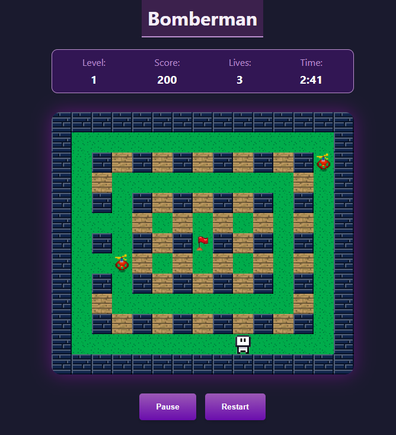

# Make Your Game

🎮 **Make Your Game** is a single-player Bomberman-inspired game built entirely with vanilla JavaScript, HTML, and CSS—no frameworks, no canvas, just pure DOM manipulation. The project features a custom game engine and tools, designed from scratch to deliver smooth, consistent 60 FPS gameplay and a fully responsive experience across devices.

## Features

- **60 FPS Animation:** Uses `requestAnimationFrame` for buttery-smooth motion and consistent frame rates.
- **Performance Diagnostics:** Built-in FPS counter, frame time stats, and dropped frame warnings for real-time performance monitoring.
- **Responsive Design:** The game grid and UI scale seamlessly to any screen size, from desktop to mobile.
- **Pause Menu:** Pause, continue, or restart the game at any time with a clean overlay menu.
- **Scoreboard:** Real-time display of score, remaining lives, and a countdown timer.
- **Keyboard Controls:** Play entirely with the keyboard. Hold movement keys for smooth, continuous motion—no key spamming required.
- **Minimal DOM Layers:** Optimized rendering with minimal DOM nesting for best performance.
- **Custom Levels:** Increasingly challenging levels with unique layouts and enemy placements.
- **No Frameworks or Canvas:** 100% native JS, HTML, and CSS.

## Controls

- **Arrow Keys:** Move the player.
- **Spacebar:** Place a bomb.
- **P:** Pause the game.
- **R** Restart the game.

## How It Works

- The game board is rendered as a CSS Grid, with each cell, player, enemy, bomb, and explosion represented by a DOM element.
- All movement and animations are handled via `transform: translate(...)` for maximum performance.
- The game loop is driven by `requestAnimationFrame`, and the timer uses `setInterval` for countdown logic.
- The game state is managed in a single `GAME_DATA` object, making it easy to reset or update the game.

## Getting Started

1. **Clone or Download the Repository**
2. **Open `index.html` in your browser**
3. **Play!**

No build steps or dependencies required.

## Project Structure

```
/js
  animation.js      # Main game loop and animation logic
  main.js           # Initialization and event handling
  player.js         # Player controls and movement
  enemies.js        # Enemy logic and AI
  bomb.js           # Bomb placement and explosions
  grid.js           # Grid and cell management
  data.js           # Game state and level data
  endGame.js        # Win/Lose menu logic
  timer.js          # Countdown timer logic
style.css           # Responsive and modern CSS
index.html          # Main HTML file
README.md           # This file
```

## Screenshots



## License

This project is open source and free to use for learning or personal projects.

---

Enjoy the game and feel free to fork, modify, or contribute!
